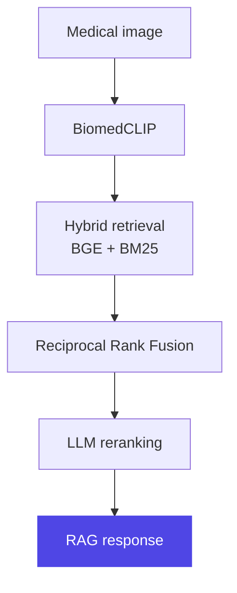

<div align="center">

<br>
<br>

<h1>NIKHIL WAKODE</h1>

<sub>AI ENGINEER &nbsp;·&nbsp; FULL-STACK BUILDER</sub>

<br>
<br>

**I build AI-powered products and the systems behind them.**

<br>

<a href="https://github.com/NikhilNWakode">GitHub</a> &nbsp;&nbsp;·&nbsp;&nbsp; <a href="https://www.linkedin.com/in/wakode-nikhil/">LinkedIn</a> &nbsp;&nbsp;·&nbsp;&nbsp; <a href="mailto:wakode333nikhil@gmail.com">Email</a>

<br>
<br>
<br>

</div>

<sub>ABOUT</sub>

### I like turning ambiguous ideas into working systems.

I'm a Computer Science engineer working across AI engineering, backend systems and full-stack development — mostly with LLMs, RAG, multimodal AI, retrieval and evaluation, and on products built for developers.

I learn by building. Past the APIs and abstractions is where it gets useful: why a system works, where it fails, and how to make it better.

<br>
<br>

<sub>01 &nbsp;/&nbsp; SELECTED WORK</sub>

<h1>MedVisionAI</h1>

<sub>MULTIMODAL AI &nbsp;·&nbsp; HYBRID RAG &nbsp;·&nbsp; MEDICAL IMAGING</sub>

A full-stack multimodal AI system that brings medical vision, retrieval, reranking and LLMs together in one complete product — from DICOM processing to real-time RAG chat, structured AI reports and HL7 FHIR R4 export.



```text
TYPE         Multimodal AI
RETRIEVAL    Hybrid · BGE + BM25
VISION       BiomedCLIP
VECTOR DB    Qdrant
DATA         PostgreSQL
CACHE        Redis
OUTPUT       Reports · FHIR R4
```

> **I built it because I wanted to understand what happens beyond simply calling an LLM API.**

`BiomedCLIP` `BGE` `BM25` `RRF` `Qdrant` `PostgreSQL` `Redis` `DICOM` `Docker` `GitHub Actions`

[View repository →](https://github.com/NikhilNWakode/MedVisionAI)

<br>
<br>

<sub>02 &nbsp;/&nbsp; HOW I BUILD</sub>

### **Problem** &nbsp;→&nbsp; **Understand** &nbsp;→&nbsp; **Prototype** &nbsp;→&nbsp; **Build** &nbsp;→&nbsp; **Measure** &nbsp;→&nbsp; **Iterate** &nbsp;→&nbsp; **Ship**

> I don't start with *which technology should I use?*<br>
> I start with ***what problem am I actually trying to solve?***

The stack comes after I understand the system. I prototype early, because a rough version that runs shows the real questions faster than a plan does — and I measure before I trust anything.

<br>
<br>

<sub>ENGINEERING STACK</sub>

<sub>AI / ML</sub>

`Python` `LLMs` `RAG` `Embeddings` `BM25` `Reranking` `Groq`

<sub>BACKEND / DATA</sub>

`FastAPI` `Node.js` `PostgreSQL` `MongoDB` `Redis` `Qdrant`

<sub>FRONTEND</sub>

`React` `Next.js` `TypeScript` `Tailwind CSS`

<sub>INFRASTRUCTURE</sub>

`Docker` `Git` `GitHub Actions`

<br>
<br>

<sub>EXPERIENCE</sub>

### TripFactory

Software Developer Intern &nbsp;·&nbsp; <sub>JAN 2026 — APR 2026</sub>

## 46

<sub>ISSUE CATEGORIES CLASSIFIED BY AN LLM PIPELINE</sub>

```text
2026
 │
 ├── TripFactory
 │    LLM classification
 │    Risk scoring
 │    PII anonymization
 │
 └── Enterprise API systems
```

- Built an LLM-powered NLP pipeline for customer-support issue classification across 46 categories, using the Groq API with Qwen2.5 and Phi-3-mini.
- Built supplier risk scoring and the escalation workflows around it.
- Designed PII anonymization and semantic issue analysis.
- Built JWT authentication and authorization with Java and Spring Boot.
- Debugged and optimized legacy enterprise APIs.

> **Building AI systems with real data is very different from building a clean demo.**

<br>
<br>

<sub>CURRENTLY</sub>

### Exploring what happens when AI moves from a demo into a real product.

**AI Systems**<br>
LLM applications · RAG & retrieval · Multimodal AI · Agents · Evaluation · AI infrastructure

**Backend**<br>
APIs · Databases · Caching · Async systems · Scalability

**Product**<br>
Developer experience · Real-time systems · Observability · Shipping

<br>
<br>

<sub>PRINCIPLES</sub>

<sub>01</sub> &emsp; **BUILD BEFORE YOU OVERTHINK.**

<sub>02</sub> &emsp; **UNDERSTAND THE ABSTRACTION BEFORE DEPENDING ON IT.**

<sub>03</sub> &emsp; **A WORKING SYSTEM TEACHES MORE THAN A PERFECT PLAN.**

<sub>04</sub> &emsp; **IF YOU CAN'T EXPLAIN YOUR ARCHITECTURE, YOU PROBABLY DON'T OWN IT.**

<br>
<br>
<br>

<div align="center">

<hr>

<br>

<sub>BUILDING SOMETHING INTERESTING?</sub>

### AI systems. Developer tools. Interesting technical problems.

<br>

<a href="https://github.com/NikhilNWakode">GitHub</a> &nbsp;&nbsp;·&nbsp;&nbsp; <a href="https://www.linkedin.com/in/wakode-nikhil/">LinkedIn</a> &nbsp;&nbsp;·&nbsp;&nbsp; <a href="mailto:wakode333nikhil@gmail.com">wakode333nikhil@gmail.com</a>

<br>

<hr>

</div>
