  
  
  

ABOUT

### I like turning ambiguous ideas into working systems.

I'm a Computer Science engineer working across **AI engineering, backend systems and full-stack development**. Most of my time goes into LLMs, RAG, multimodal AI, retrieval and evaluation — and into products built for developers.

I learn by building. Past the APIs and abstractions is where it gets interesting: why a system works, where it fails, and how to make it better.

  
  
  
  
  
  

SELECTED WORK

A full-stack multimodal AI system that brings medical vision, retrieval, reranking and LLMs together in one complete product — from DICOM processing to real-time RAG chat, structured AI reports and HL7 FHIR R4 export.

> **I built it because I wanted to understand what happens beyond simply calling an LLM API.**

| Layer | Built with |
| :-- | :-- |
| **Vision** | BiomedCLIP medical image embeddings |
| **Retrieval** | BGE + BM25 hybrid search, Reciprocal Rank Fusion |
| **Ranking** | LLM-based reranking |
| **Output** | Real-time RAG chat · structured reports · HL7 FHIR R4 |
| **Data** | PostgreSQL · Qdrant · Redis caching |
| **Delivery** | Docker · GitHub Actions |

  
  
  
  
  
  

HOW I BUILD

> I don't start with *"Which technology should I use?"* 
> I start with **"What problem am I actually trying to solve?"**

The stack comes after I understand the system. I prototype early, because a rough version that runs surfaces the real questions faster than any plan — and I measure before I trust it.

ENGINEERING STACK

**AI / ML** 
 &nbsp;

**Backend / Data** 
 &nbsp;

**Frontend** 

**Infrastructure** 

EXPERIENCE

- Built an LLM-powered NLP pipeline for customer-support issue classification across **46 categories**, using the Groq API with Qwen2.5 and Phi-3-mini.
- Built supplier risk scoring and the escalation workflows around it.
- Designed PII anonymization and semantic issue analysis.
- Built JWT authentication and authorization with Java and Spring Boot.
- Debugged and optimized legacy enterprise APIs.

> **Building AI systems with real data is very different from building a clean demo.**

CURRENTLY

### Exploring what happens when AI moves from a demo into a real product.

<table>
  <tr>
    <th align="left">AI Systems</th>
    <th align="left">Backend</th>
    <th align="left">Product</th>
  </tr>
  <tr valign="top">
    <td>LLM applications RAG &amp; retrieval Multimodal AI Agents Evaluation AI infrastructure</td>
    <td>APIs Databases Caching Async systems Scalability</td>
    <td>Developer experience Real-time systems Observability Shipping</td>
  </tr>
</table>

 

ACTIVITY

<picture>
  <source media="(prefers-color-scheme: dark)" srcset="https://raw.githubusercontent.com/NikhilNWakode/NikhilNWakode/output/snake-dark.svg">
  <source media="(prefers-color-scheme: light)" srcset="https://raw.githubusercontent.com/NikhilNWakode/NikhilNWakode/output/snake-light.svg">
  
</picture>

 
 

  
  

