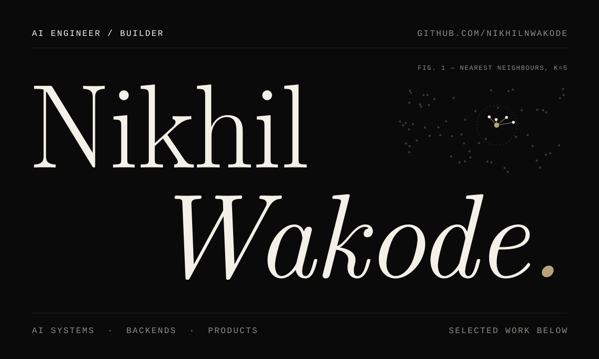
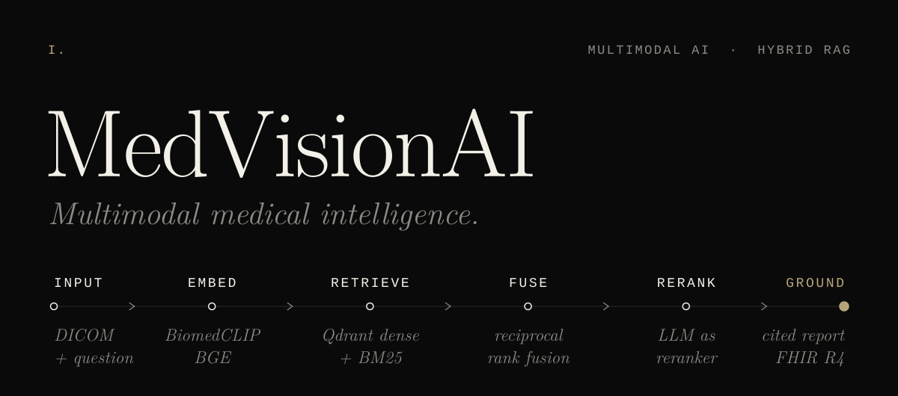
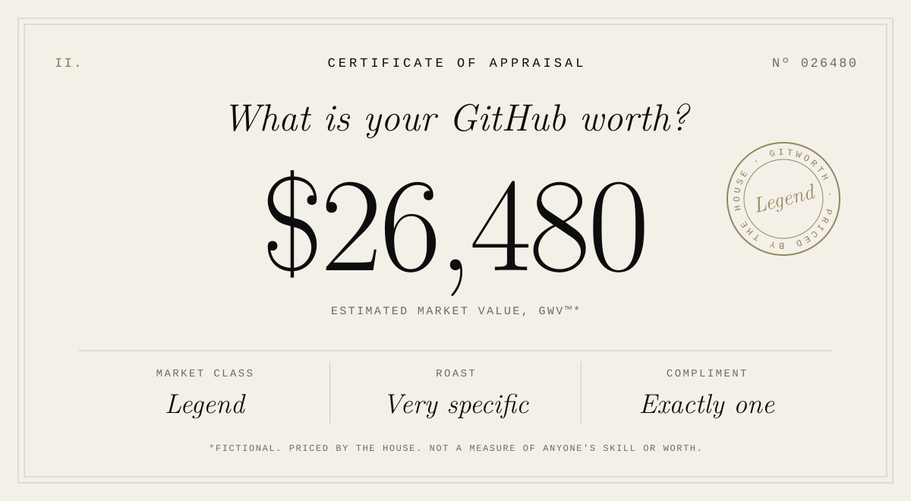

<picture>
  <source media="(prefers-color-scheme: dark)" srcset="assets/hero-dark.svg">
  <source media="(prefers-color-scheme: light)" srcset="assets/hero-light.svg">
  
</picture>

 
 

I build AI systems, the backends under them, and the products around them. 
Mostly to find out how they actually work. Sometimes the prototype survives.

[GitHub ↗](https://github.com/NikhilNWakode) &nbsp;&nbsp; [LinkedIn ↗](YOUR_LINKEDIN_URL) &nbsp;&nbsp; [Email ↗](mailto:wakode333nikhil@gmail.com)

 
 
 

<picture>
  <source media="(prefers-color-scheme: dark)" srcset="assets/medvision-dark.svg">
  <source media="(prefers-color-scheme: light)" srcset="assets/medvision-light.svg">
  
</picture>

 

A medical image and a clinical question go in. A grounded, cited answer comes out — as a chat reply, a structured report, or an HL7 FHIR R4 record.

I built it to see what actually happens after you call the model: why dense search misses exact clinical terms, why fusing two rankings beats tuning one, and where an LLM is worth its latency.

<samp>BiomedCLIP · BGE · BM25 · RRF · Qdrant · PostgreSQL · Redis · FastAPI · DICOM · Docker</samp>

**[Explore the project →](https://github.com/NikhilNWakode/MedVisionAI)**

 
 
 

<picture>
  <source media="(prefers-color-scheme: dark)" srcset="assets/gitworth-dark.svg">
  <source media="(prefers-color-scheme: light)" srcset="assets/gitworth-light.svg">
  
</picture>

 

Hand over a GitHub handle and the house prices it: a valuation, one of twenty market classes, a very specific roast, and exactly one genuine compliment.

The valuation model is deterministic. 
The disrespect is not.

**[Get appraised →](https://gitworthhub.vercel.app/)**

 
 
 

<samp>LATELY</samp>

### Retrieval that survives real data. Agents that know when to stop. Evals that don't flatter.

 
 

<samp>PREVIOUSLY</samp>

**TripFactory** 
<samp>SOFTWARE DEVELOPER INTERN · JAN — APR 2026</samp>

Built the LLM pipeline that sorts support tickets into 46 issue categories, with PII stripped before any text reached a model. Put Groq, Qwen2.5 and Phi-3-mini side by side on quality, latency and cost. Wrote the supplier risk scoring and escalation logic that acted on the results — and, on the side, JWT auth in Spring Boot and a fair amount of legacy API archaeology.

 

<samp>WORKING WITH</samp>

<samp>ai</samp>&ensp; Python · LLMs · RAG · retrieval · embeddings · Qdrant 
<samp>backend</samp>&ensp; FastAPI · Node · Spring Boot · PostgreSQL · Redis 
<samp>product</samp>&ensp; React · Next.js · TypeScript 
<samp>infra</samp>&ensp; Docker · GitHub Actions

 
 
 

<picture>
  <source media="(prefers-color-scheme: dark)" srcset="assets/footer-dark.svg">
  <source media="(prefers-color-scheme: light)" srcset="assets/footer-light.svg">
  
</picture>

 

If you're building one of those, **[write to me →](mailto:wakode333nikhil@gmail.com)**

[GitHub ↗](https://github.com/NikhilNWakode) &nbsp;&nbsp; [LinkedIn ↗](https://www.linkedin.com/in/wakode-nikhil/) &nbsp;&nbsp; [Email ↗](mailto:wakode333nikhil@gmail.com)
